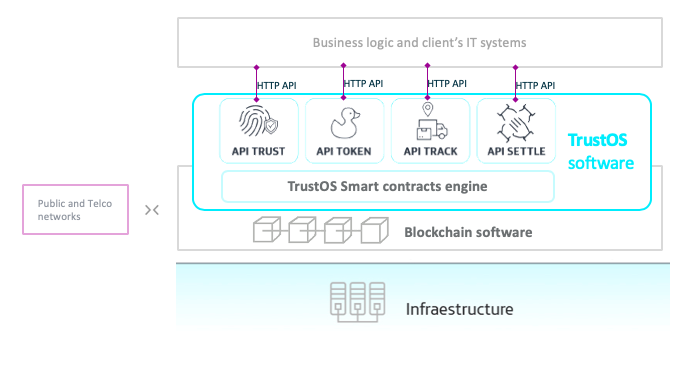

# Architecture

**TrustOS** software can be deployed on any Hyperledger Fabric based blockchain network. Support for Quorum/Ethereum and CORDA based networks will be added soon. Once deployed, an HTTP API is published so that it can be used from any programming language. The API hides much of the complexity of working with a Blockchain, but its direct use still requires low-level knowledge. For that reason, TrustOS also includes some libraries to be consumed by applications and other Smart Contracts. Therefore, TrustOS commands can be invoked from outside Blockchain through its APIs or from other Smart Contracts inside the Blockchain itself. 

TrustOS also includes some administration features and interfaces that allow the developer community to add new modules to TrustOS. 

- **How does it work?**

The following figure describes a layer-based architecture:

APIs do not speak the **Blockchain language** (send, validate or verify a transaction, query a block, provision or obtain gas at an address, compile, deploy or execute contracts, manage and safeguard cryptographic material, etc.) but the language a customer understands (create an asset and update its status or position, add account activity, verify an identity, create or transfer a token, etc.). 

Initially, **TrustOS** is available for deployment on any Hyperledger Fabric-based network and interacts with Ethereum (the public network). In the coming months support will be added for implementation in other technologies such as Ethereum/Quorum or CORDA. 
